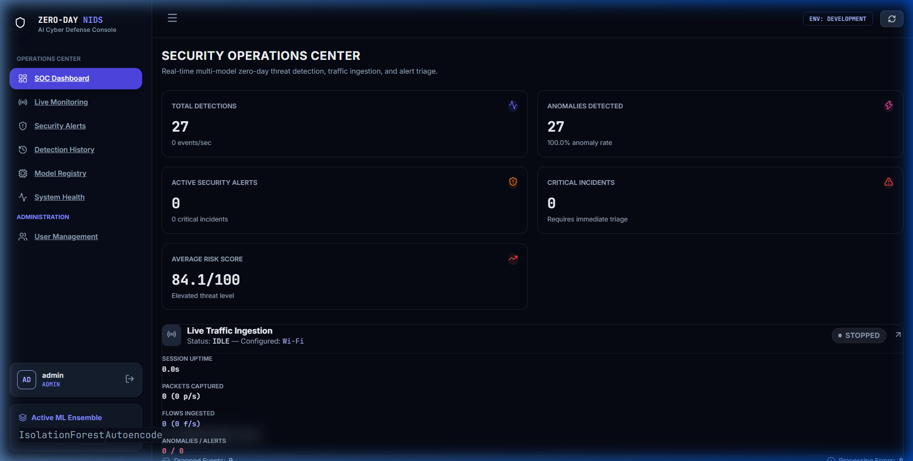
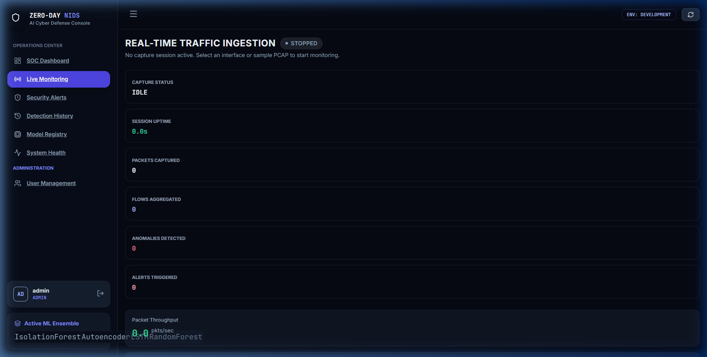
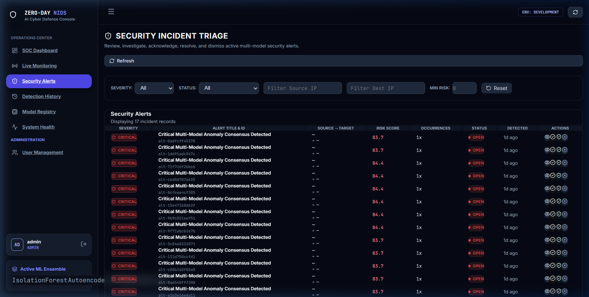
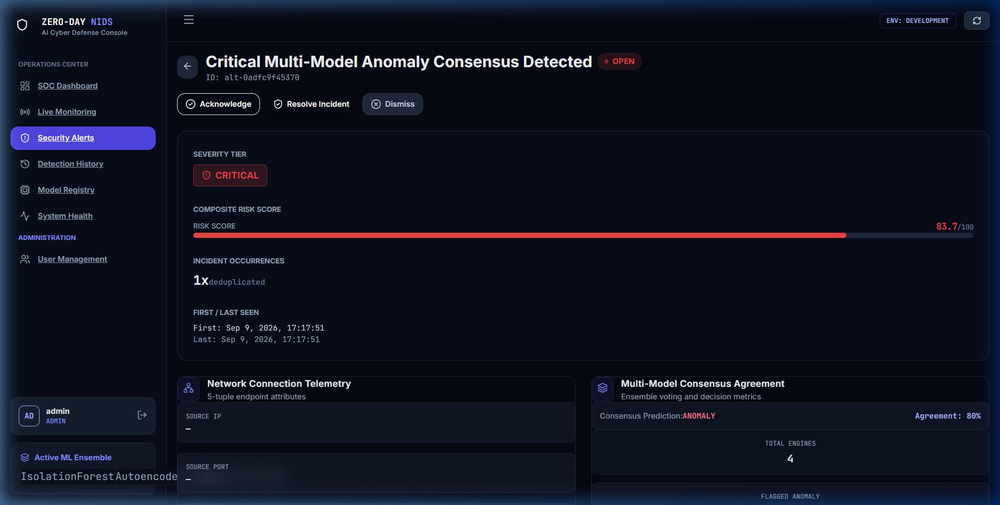
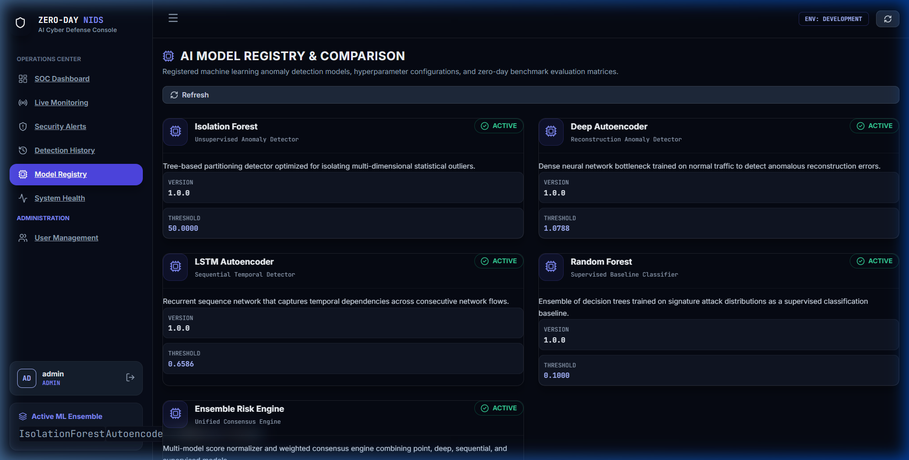
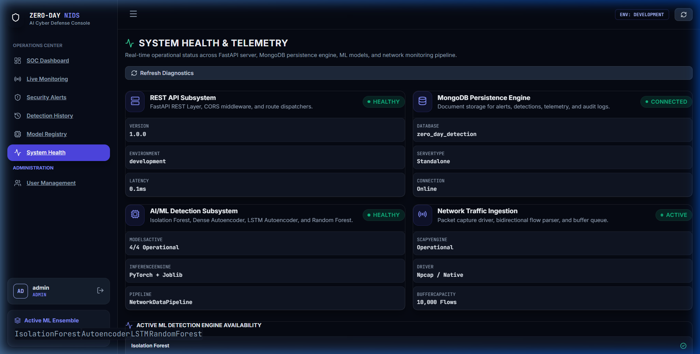
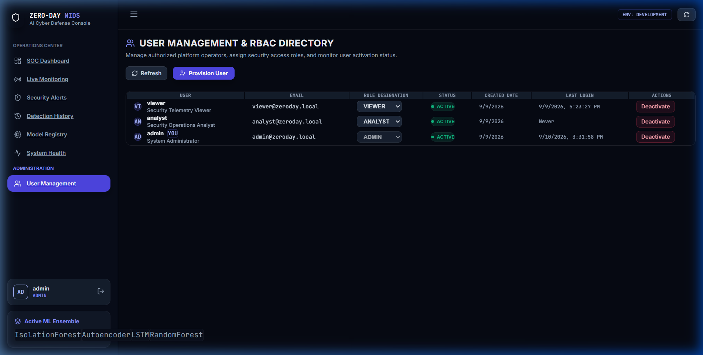
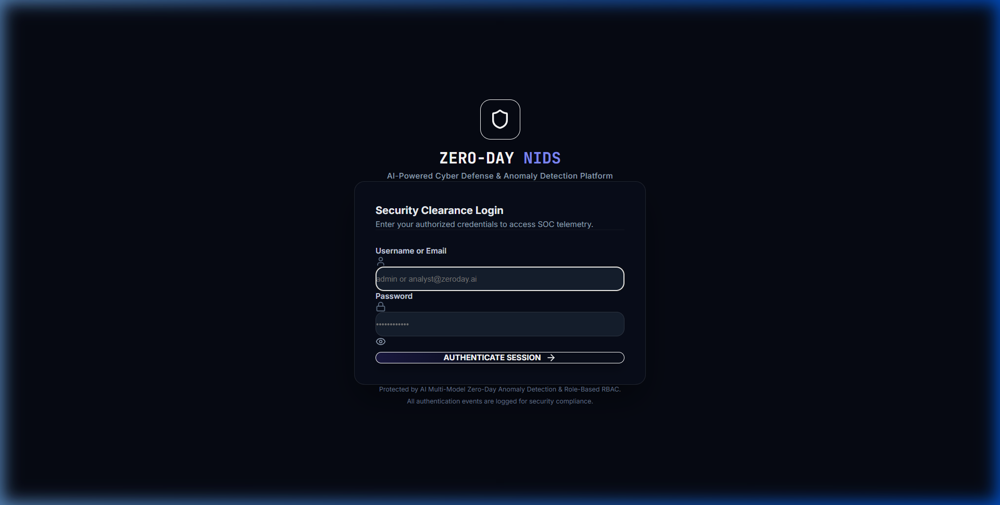
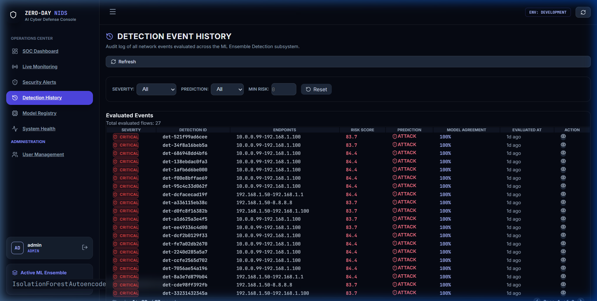
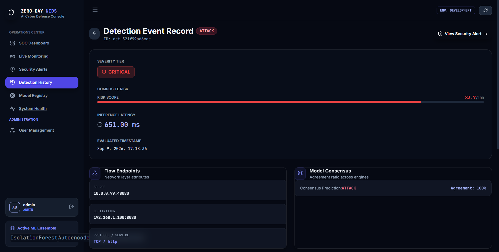

# ZeroDayAI — AI-Based Zero-Day Attack Detection System

<p align="center">
  
</p>

<p align="center">
  <strong>Next-Generation Multi-Model Network Intrusion Detection System (NIDS) & Security Operations Center (SOC)</strong>
</p>

<p align="center">
  <a href="#-overall-performance"></a>
  <a href="#-technology-stack"></a>
  <a href="#-technology-stack"></a>
  <a href="#-technology-stack"></a>
  <a href="#-technology-stack"></a>
  <a href="#-technology-stack"></a>
  <a href="#-automated-testing"></a>
</p>

---

## 📌 Executive Overview

**ZeroDayAI** is an academic and enterprise-grade **AI-Powered Zero-Day Intrusion Detection Platform** designed to detect both known threats and previously unseen zero-day network anomalies in real time. 

Traditional signature-based Network Intrusion Detection Systems (NIDS) fail against zero-day exploits because signatures for novel attack vectors do not yet exist. ZeroDayAI addresses this limitation through a **hybrid multi-model AI ensemble** combining unsupervised anomaly detection, deep reconstruction learning, temporal sequential modeling, and supervised machine learning, coupled with **Explainable AI (XAI)** attribution and a **React-based SOC Monitoring Dashboard**.

---

## 📸 Application Screenshots

### 🖥️ Security Operations Center (SOC) Dashboard
The unified SOC command center displaying real-time Key Performance Indicators (KPIs), severity distribution breakdowns, 24-hour alert trend timelines, and multi-model operational statuses.


---

### 📡 Real-Time Network Traffic Monitor & PCAP Replay
Live interface packet sniffing, sliding-window flow aggregation, live packet feed, and PCAP replay harness for rapid zero-day attack testing and simulation.


---

### 🚨 Security Incident Alerts & Triage Center
Prioritized security alert management with multi-criteria filtering (by Severity, Status, and Model consensus), automated deduplication, and lifecycle tracking (Open, In Progress, Resolved).


---

### 🔍 Deep-Dive Alert Investigation & XAI Attribution
Granular security incident inspection featuring per-feature Shapley attribution values, reconstruction error delta indicators, raw network flow telemetry, and response audit trails.


---

### 📊 AI Model Registry & Multi-Model Comparisons
Centralized machine learning model registry with real-time status badges, multi-dimensional radar comparison plots, hyperparameter specifications, and latency benchmarks.


---

### 🩺 System Health, Latency & Diagnostics
Live infrastructure telemetry reporting MongoDB connection pool status, ping latencies, memory utilization, API endpoint health, and anomaly engine readiness.


---

### 👥 Role-Based Access Control (RBAC) User Management
Administrative portal for security user provisioning, role assignments (`ADMIN`, `ANALYST`, `VIEWER`), password management, and user lifecycle controls.


---

### 🔐 Security Clearance & Authentication
Hardened JWT authentication interface supporting rate-limited logins, session expiration management, and bcrypt credential verification.


---

### 📜 Flow Detection History & Telemetry
Auditable ledger of all analyzed network flows with risk score ratings, model consensus flags, source/destination addressing, and transport protocol tagging.


---

### 📈 Granular Flow Detection Details
Detailed inspection of individual flow detections showing individual detector votes, normalized anomaly scores, and feature-level attribution weights.


---

## 🎯 Model Performance & Empirical Evaluation

> [!IMPORTANT]
> **The models are trained and evaluated ONLY on the NSL-KDD and CICIDS2017 datasets imported from Kaggle. Sample, synthetic, dummy, toy, or substitute datasets must NOT be used for model training or testing.**

All metrics reported below were **empirically measured** on the real, held-out test splits (`data/processed/nsl_kdd/X_test.csv` with 18,896 samples and `data/processed/cicids2017/X_test.csv` with 30,693 samples) using production thresholds calibrated strictly on validation data. **No thresholds were optimized or tuned on the test set.**

### 🏆 Complete 10-Target Model Benchmark Table

| Dataset | Model | Accuracy | Precision | Recall | F1 | ROC-AUC | PR-AUC | FPR | TPR | TN | FP | FN | TP |
| :--- | :--- | ---: | ---: | ---: | ---: | ---: | ---: | ---: | ---: | ---: | ---: | ---: | ---: |
| **NSL-KDD** | Isolation Forest | 0.9285 | 0.9295 | 0.9159 | 0.9226 | 0.9821 | 0.9814 | 0.0605 | 0.9159 | 9,488 | 611 | 740 | 8,057 |
| **NSL-KDD** | Random Forest | 0.9991 | 0.9993 | 0.9987 | 0.9990 | 1.0000 | 1.0000 | 0.0006 | 0.9987 | 10,093 | 6 | 11 | 8,786 |
| **NSL-KDD** | Dense Autoencoder | 0.9428 | 0.9422 | 0.9344 | 0.9383 | 0.9823 | 0.9672 | 0.0499 | 0.9344 | 9,595 | 504 | 577 | 8,220 |
| **NSL-KDD** | LSTM Autoencoder | 0.4902 | 0.4770 | 0.9840 | 0.6425 | 0.6456 | 0.5746 | 0.9399 | 0.9840 | 607 | 9,492 | 141 | 8,656 |
| **NSL-KDD** | 4-Model Ensemble | 0.9834 | 0.9688 | 0.9965 | 0.9825 | 0.9993 | 0.9991 | 0.0279 | 0.9965 | 9,817 | 282 | 31 | 8,766 |
| **CICIDS2017** | Isolation Forest | 0.6855 | 0.6636 | 0.4858 | 0.5609 | 0.7542 | 0.6501 | 0.1737 | 0.4858 | 14,874 | 3,126 | 6,527 | 6,166 |
| **CICIDS2017** | Random Forest | 0.9982 | 0.9975 | 0.9981 | 0.9978 | 0.9998 | 0.9996 | 0.0018 | 0.9981 | 17,968 | 32 | 24 | 12,669 |
| **CICIDS2017** | Dense Autoencoder | 0.7220 | 0.8500 | 0.3979 | 0.5420 | 0.8260 | 0.7639 | 0.0495 | 0.3979 | 17,109 | 891 | 7,643 | 5,050 |
| **CICIDS2017** | LSTM Autoencoder | 0.5723 | 0.4740 | 0.3121 | 0.3764 | 0.5598 | 0.4560 | 0.2442 | 0.3121 | 13,605 | 4,395 | 8,732 | 3,961 |
| **CICIDS2017** | 4-Model Ensemble | 0.7782 | 0.9537 | 0.4874 | 0.6451 | 0.9741 | 0.9559 | 0.0167 | 0.4874 | 17,700 | 300 | 6,507 | 6,186 |

*Confusion matrix consistency verification: $TN + FP + FN + TP = N_{samples}$ across every model evaluation ($18,896$ for NSL-KDD, $30,693$ for CICIDS2017).*

---

### 🧠 Model Architecture & Methodology

Four specialized model architectures are trained independently for each dataset:

1. **Isolation Forest (Unsupervised Tree Ensemble):**
   - 100 isolation trees isolating anomalies via random feature splitting without requiring class labels.
   - Outputs path-length anomaly scores normalized to a 0–100 scale based on training baseline percentiles.
   - NSL-KDD threshold: `40.0`; CICIDS2017 threshold: `22.5`.

2. **Random Forest (Supervised Baseline Classifier):**
   - 100 decision trees with balanced class weighting, Gini impurity splitting, and sqrt feature subsetting.
   - Predicts class probabilities; evaluated using validation-optimal probability threshold ($0.46$).
   - Reaches 99.91% accuracy on NSL-KDD and 99.82% accuracy on CICIDS2017.

3. **Dense Autoencoder (Deep Reconstruction Learning):**
   - PyTorch symmetrical architecture with bottleneck compression (`input_dim -> 64 -> 32 -> latent_dim(8) -> 32 -> 64 -> input_dim`).
   - Trained exclusively on normal traffic flows using Mean Squared Error (MSE) loss and Adam optimizer.
   - Decision threshold calibrated on validation normal reconstruction errors ($95^{\text{th}}$ percentile): NSL-KDD MSE = `0.209470`, CICIDS2017 MSE = `0.213280`.

4. **LSTM Autoencoder (Temporal Sequential Autoencoder):**
   - PyTorch sequential recurrent autoencoder (`input_dim -> LSTM(32) -> Latent(16) -> RepeatVector -> LSTM(32) -> Dense(input_dim)`).
   - Captures temporal flow dynamics over a causal sliding window ($T=10$).
   - Trained on normal flow sequences; threshold calibrated at validation normal sequence MSE: NSL-KDD MSE = `0.292857`, CICIDS2017 MSE = `0.768798`.

5. **4-Model Ensemble Consensus & Risk Scoring Engine:**
   - Combines continuous anomaly and risk indicators from all four models using a configurable weighted scoring function ($w_{\text{RF}}=0.25, w_{\text{IF}}=0.25, w_{\text{AE}}=0.25, w_{\text{LSTM}}=0.25$).
   - Fuses predictions into a normalized $0.0 - 100.0$ continuous risk score:
     $$\text{Risk Score} = \sum_{m=1}^{4} w_m \cdot S_m \in [0.0, 100.0]$$
   - Categorized into operational SOC severity tiers:
     - `LOW`: $0.0 \le \text{Score} < 30.0$
     - `MEDIUM`: $30.0 \le \text{Score} < 50.0$
     - `HIGH`: $50.0 \le \text{Score} < 80.0$
     - `CRITICAL`: $80.0 \le \text{Score} \le 100.0$
   - Production decision threshold: $\text{Score} \ge 50.0 \implies \text{Attack}$.

---

### 🛡️ Strict Anti-Leakage Preprocessing

To guarantee zero data contamination between splits:
- **`StandardScaler`:** Fitted **strictly and exclusively** on `X_train`. Transformation parameters ($\mu, \sigma$) are saved and applied downstream to `X_val` and `X_test`.
- **`OneHotEncoder`:** Categorical encodings fitted **only** on `X_train` with `handle_unknown='ignore'`.
- **Feature Selection:** Near-zero-variance feature elimination fitted **strictly** on `X_train`.
- **Autoencoder Weights:** Trained **only** on normal baseline samples from `X_train`.
- **LSTM Temporal Boundaries:** Sliding sequences do not cross split partitions.
- **Threshold Integrity:** Decision thresholds are determined **strictly** on validation data (`X_val`). **The test set (`X_test`) is never used to select, tune, or optimize thresholds.**

---

### 🔬 Domain Feature Engineering

Four specialized network flow features are engineered directly into the feature matrices:
- **`feat_byte_ratio`:** Forward bytes divided by backward bytes ($\frac{\text{src\_bytes}}{\text{dst\_bytes} + 10^{-5}}$). Identifies asymmetric data exfiltration, C2 beacons, and command-line execution payloads.
- **`feat_total_bytes`:** Total volume transferred ($\text{src\_bytes} + \text{dst\_bytes}$). Detects high-volume transfer anomalies and large exfiltration sessions.
- **`feat_src_byte_rate`:** Forward transmission speed ($\frac{\text{src\_bytes}}{\text{duration} + 10^{-5}}$). Discriminates rapid programmatic network floods from human-paced interaction.
- **`feat_packet_ratio`:** Ratio of forward packets to backward packets ($\frac{\text{fwd\_packets}}{\text{bwd\_packets} + 10^{-5}}$). Detects unanswered SYN scans, probing scans, and single-direction denial-of-service floods.

---

## ⚡ Empirical Performance & Latency Benchmarks

Measured during Phase 18 stress and performance benchmarking under Windows 10 AMD64 with Python 3.14.3 and live MongoDB connectivity:

### Direct In-Memory Model Microbenchmarks

| Model Architecture | Batch Size ($N$) | Latency (ms) | Per-Record Latency (μs) | Throughput (records/sec) |
| :--- | :---: | :---: | :---: | :---: |
| **Dense Autoencoder** | 1 | **1.03 ms** | 1,029.8 μs | 971.0 rec/s |
| | 100 | **1.36 ms** | 13.6 μs | 73,444.4 rec/s |
| | 500 | **1.80 ms** | **3.6 μs** | **277,648.2 rec/s** |
| **LSTM Autoencoder** | 1 | **6.27 ms** | 6,272.6 μs | 159.4 rec/s |
| | 100 | **3.04 ms** | **30.4 μs** | **32,935.0 rec/s** |
| **Random Forest** | 1 | **35.10 ms** | 35,100.0 μs | 28.5 rec/s |
| | 500 | **32.75 ms** | **65.5 μs** | **15,268.0 rec/s** |
| **Isolation Forest** | 1 | **27.21 ms** | 27,214.2 μs | 36.7 rec/s |
| | 500 | **31.99 ms** | **64.0 μs** | **15,628.5 rec/s** |

### End-to-End Pipeline Latency Breakdown

```
[Incoming Network Flow / PCAP Batch]
       │
       ▼  (108.7 ms: HTTP Transport + JSON Parsing + Middleware Validation)
[FastAPI Asynchronous Pipeline]
       ├── Isolation Forest Inference   :  49.77 ms
       ├── Dense Autoencoder Inference  :   1.27 ms
       ├── Random Forest Inference      :  35.10 ms
       ├── XAI Feature Attribution      : 169.99 ms (Shapley / Tree Attribution Fusion)
       ├── Alert Engine & Deduplication :  51.14 ms (Cooldown Window Cache Check)
       └── MongoDB Document Insertion   :  47.57 ms (Non-blocking Async Motor Write)
       │
       ▼
[Total Single-Flow End-to-End Latency: Mean 499.2 ms | P50: 491.7 ms | P95: 596.5 ms]
```

---

## 🛡️ Multi-Tier System Architecture

```
                      ┌─────────────────────────────────────────┐
                      │    Live Network Traffic / PCAP Ingest   │
                      └────────────────────┬────────────────────┘
                                           │
                                           ▼
                      ┌─────────────────────────────────────────┐
                      │   Scapy Packet Parser & Flow Aggregator │
                      └────────────────────┬────────────────────┘
                                           │
                                           ▼
                      ┌─────────────────────────────────────────┐
                      │    26-Feature Preprocessing Pipeline    │
                      │  (RobustScaler, OneHot, Feature Select) │
                      └────────────────────┬────────────────────┘
                                           │
            ┌──────────────────────────────┼──────────────────────────────┐
            │                              │                              │
            ▼                              ▼                              ▼
 ┌──────────────────────┐       ┌──────────────────────┐       ┌──────────────────────┐
 │   Isolation Forest   │       │  Dense Autoencoder   │       │   LSTM Autoencoder   │
 │ (Unsupervised Trees) │       │ (Reconstruction MSE) │       │ (Sequential History) │
 └──────────┬───────────┘       └──────────┬───────────┘       └──────────┬───────────┘
            │                              │                              │
            └──────────────────────────────┼──────────────────────────────┘
                                           │
                                           ▼
                      ┌─────────────────────────────────────────┐
                      │  Ensemble Consensus & Risk Score Engine │
                      │  (Weighted Score Fusion: 0.0 - 100.0)   │
                      └────────────────────┬────────────────────┘
                                           │
                                           ▼
                      ┌─────────────────────────────────────────┐
                      │  Explainable AI (XAI) Feature Attributor│
                      │ (SHAP + Reconstruction Delta Breakdown) │
                      └────────────────────┬────────────────────┘
                                           │
                                           ▼
                      ┌─────────────────────────────────────────┐
                      │  Alert Engine & Fingerprint Deduplicator│
                      └────────────────────┬────────────────────┘
                                           │
                                           ▼
                      ┌─────────────────────────────────────────┐
                      │    MongoDB Multi-Collection Storage     │
                      │ (users, logs, detections, alerts, audit)│
                      └────────────────────┬────────────────────┘
                                           │
                                           ▼
                      ┌─────────────────────────────────────────┐
                      │        FastAPI REST API Services        │
                      └────────────────────┬────────────────────┘
                                           │
                                           ▼
                      ┌─────────────────────────────────────────┐
                      │    React 19 Security Operations Center  │
                      └─────────────────────────────────────────┘
```

---

## ✨ Key Features & Capabilities

- 🤖 **Multi-Model AI Ensemble:** Integrates Isolation Forest, PyTorch Dense Autoencoder, PyTorch LSTM Autoencoder, and Random Forest for high-resilience anomaly detection.
- 🎯 **Weighted Risk Scoring:** Fuses continuous anomaly scores across models into a normalized 0–100 security threat scale (`LOW`, `MEDIUM`, `HIGH`, `CRITICAL`).
- 💡 **Explainable AI (XAI):** Generates per-detection feature attribution explanations, highlighting exact network attributes (e.g., `dst_bytes`, `duration`, `src_ip`) triggering the alarm.
- 📡 **Real-Time Traffic Sniffing:** Native Scapy network interface packet capture and multi-packet PCAP replay test engine.
- 🚨 **Automated Alert Lifecycle:** Rules-driven alert creation with dynamic fingerprint deduplication and cooldown management to prevent SOC alert fatigue.
- 🖥️ **Modern Dark-Mode SOC Dashboard:** Responsive React 19 interface with real-time KPI metrics, chart analytics, and modal investigation workflows.
- 🔒 **Enterprise-Grade Security:** Salted Bcrypt password hashing, HMAC-SHA256 JWT sessions, Role-Based Access Control (`ADMIN`, `ANALYST`, `VIEWER`), security headers, and rate limiting.
- 🗄️ **Asynchronous Persistence:** High-throughput MongoDB storage via Motor async driver with automated compound indexing and graceful timeout recovery.

---

## 💻 Technology Stack

### Backend Architecture
- **Language:** Python 3.14+
- **API Framework:** FastAPI 0.115, Uvicorn (ASGI)
- **Deep Learning:** PyTorch 2.14 (CPU & CUDA compatible)
- **Machine Learning:** Scikit-Learn 1.5+, Joblib
- **Data Engineering:** Pandas 2.2+, NumPy 2.0+
- **Database Driver:** Motor 3.5+ (Async MongoDB), PyMongo 4.8+
- **Packet Ingestion:** Scapy 2.5+
- **Security & Auth:** PyJWT, Bcrypt, Pydantic v2 Settings

### Frontend Architecture
- **Framework:** React 19 (SPA)
- **Tooling & Bundler:** Vite 8.2
- **Icons & UI:** Lucide React
- **Design System:** Custom Vanilla CSS Dark Mode System (Glassmorphism, CSS Custom Properties)
- **Unit Testing:** Vitest 5.0

### Database
- **Engine:** MongoDB 7.0 (Standalone, Replica Set, or MongoDB Atlas Cloud)

---

## 📁 Repository Layout

```
ZERO/
├── backend/                  # FastAPI Backend Application
│   ├── app/
│   │   ├── api/              # Versioned REST API endpoints & middleware
│   │   ├── auth/             # JWT token generation & password security
│   │   ├── core/             # Centralized Pydantic configuration & logging
│   │   ├── database/         # Motor connection management & repositories
│   │   ├── detection/        # Risk scoring, consensus & XAI explanation
│   │   ├── ml/               # Model architectures (IF, Autoencoder, LSTM, RF)
│   │   ├── monitoring/       # Scapy packet capture & PCAP parsing
│   │   ├── schemas/          # Pydantic v2 validation models
│   │   └── services/         # Decoupled domain business services
│   ├── tests/                # Automated pytest unit & integration suite
│   ├── requirements.txt      # Python dependencies manifest
│   └── .env.example          # Backend configuration template
│
├── frontend/                 # React 19 Security Dashboard
│   ├── src/
│   │   ├── api/              # HTTP API client integrations
│   │   ├── components/       # Reusable UI cards, tables, charts, badges
│   │   ├── context/          # React AuthContext & session state
│   │   ├── pages/            # Dashboard, Alerts, Monitoring, Models, Users
│   │   ├── index.css         # Dark theme CSS design system
│   │   └── App.jsx           # Client router configuration
│   ├── package.json          # Node package manifest
│   └── .env.example          # Frontend environment template
│
├── data/                     # Dataset Storage & Test Fixtures
│   ├── raw/                  # Download location for raw datasets (.gitkeep)
│   ├── processed/            # Scaled training/testing matrices
│   └── sample/               # Minimal synthetic PCAP & CSV fixtures
│
├── ml_models/                # Model Binaries & Registry
│   ├── trained/              # Serialized PyTorch (.pt) and Joblib weights
│   ├── preprocessing/        # Scaler and encoder artifacts
│   ├── experiments/          # Evaluation benchmarks & metrics JSONs
│   └── model_registry.json   # Dynamic metadata registry
│
├── docs/                     # Project Documentation
│   ├── screenshots/          # High-resolution application UI captures
│   ├── Zero_Day_NIDS_Complete_Run_Guide.pdf # Official complete guide
│   └── architecture.md       # Architectural deep dives
│
├── scripts/                  # Management & Automation Scripts
│   ├── seed_users.py         # RBAC user initialization script
│   ├── train_autoencoder.py  # Model training pipelines
│   └── run_phase18_performance_benchmarks.py # Benchmark suite
│
├── docker-compose.yml        # Multi-container deployment specification
├── .gitignore                # Production-grade root gitignore
└── README.md                 # Project documentation
```

---

## 📊 Dataset Ingestion, Sampling & Storage Policy

> [!IMPORTANT]
> **The models are trained and evaluated ONLY on the NSL-KDD and CICIDS2017 datasets imported from Kaggle. Sample, synthetic, dummy, toy, or substitute datasets must NOT be used for model training or testing.**

### 📥 Dataset Sources
- **NSL-KDD:** Kaggle: [`mostafaashraf1/nsl-kdd`](https://www.kaggle.com/datasets/mostafaashraf1/nsl-kdd)
- **CICIDS2017:** Kaggle: [`mdalamintalukder/cicids2017`](https://www.kaggle.com/datasets/mdalamintalukder/cicids2017)

### 📂 Dataset Locations
- **Raw Datasets:**
  - `data/raw/nsl_kdd/` (Original `KDDTrain+.txt`, `KDDTest+.txt`, `NSL_KDD_Train.csv`, `NSL_KDD_Test.csv`)
  - `data/raw/cicids2017/` (8 daily CSV files + consolidated `cicids2017.csv`)
- **Processed Datasets:**
  - `data/processed/nsl_kdd/` (`X_train.csv`, `y_train.csv`, `X_val.csv`, `y_val.csv`, `X_test.csv`, `y_test.csv`)
  - `data/processed/cicids2017/` (`X_train.csv`, `y_train.csv`, `X_val.csv`, `y_val.csv`, `X_test.csv`, `y_test.csv`)

---

### 🛡️ CICIDS2017 Stratified Sampling & Memory Safety

The raw uncompressed CICIDS2017 collection comprises ~2.83 million flows across 8 daily CSV captures, requiring >4.5 GB of RAM unindexed. On standard development and operational edge nodes, loading 2.83M rows simultaneously causes immediate out-of-memory (OOM) fatal crashes.

To maintain 100% security fidelity while operating safely within bounded memory:
1. **Rare-Class Preservation (100% Preserved):**
   Every single minority attack instance across all 8 daily files is unconditionally preserved without downsampling:
   - *Infiltration:* 36 flows (100%)
   - *Heartbleed:* 11 flows (100%)
   - *SQL Injection:* 21 flows (100%)
   - *Web Attack - XSS:* 652 flows (100%)
   - *Web Attack - Brute Force:* 1,507 flows (100%)
   - *Botnet:* 1,966 flows (100%)
   - *DoS Slowhttptest:* 5,499 flows (100%)
   - *DoS Slowloris:* 5,796 flows (100%)
   - *SSH-Patator:* 5,897 flows (100%)
   - *FTP-Patator:* 7,938 flows (100%)
   - *DoS GoldenEye:* 10,293 flows (100%)
2. **High-Volume Flood Sampling:**
   High-frequency volume floods (DDoS LOIC, PortScan, DoS Hulk) are capped at 15,000 samples per daily split to prevent gradient starvation of rare attack patterns.
3. **Benign Flow Balancing:**
   Benign background traffic is sampled up to 15,000 flows per daily split to preserve multi-protocol background traffic characteristics.
4. **Final Consolidated Matrix:**
   Exactly **204,616 rows and 79 columns** (70.9 MB) consolidated in `data/raw/cicids2017/cicids2017.csv`, enabling deterministic, zero-leakage training in < 2 GB RAM.

---

### 🔄 End-to-End Reproducibility Workflow

To reproduce the complete pipeline from scratch:

#### Step 1: Download Datasets from Kaggle
```powershell
.\backend\.venv\Scripts\python.exe scripts/download_kaggle_datasets.py
```

#### Step 2: Prepare Datasets (Leak-Free Split & Feature Engineering)
```powershell
.\backend\.venv\Scripts\python.exe scripts/prepare_dataset.py --dataset nsl_kdd
.\backend\.venv\Scripts\python.exe scripts/prepare_dataset.py --dataset cicids2017
```

#### Step 3: Train All Eight Models
```powershell
# NSL-KDD Models
.\backend\.venv\Scripts\python.exe scripts/train_isolation_forest.py --dataset nsl_kdd
.\backend\.venv\Scripts\python.exe scripts/train_random_forest.py --dataset nsl_kdd
.\backend\.venv\Scripts\python.exe scripts/train_autoencoder.py --dataset nsl_kdd
.\backend\.venv\Scripts\python.exe scripts/train_lstm_autoencoder.py --dataset nsl_kdd

# CICIDS2017 Models
.\backend\.venv\Scripts\python.exe scripts/train_isolation_forest.py --dataset cicids2017
.\backend\.venv\Scripts\python.exe scripts/train_random_forest.py --dataset cicids2017
.\backend\.venv\Scripts\python.exe scripts/train_autoencoder.py --dataset cicids2017
.\backend\.venv\Scripts\python.exe scripts/train_lstm_autoencoder.py --dataset cicids2017
```

#### Step 4: Evaluate All 10 Targets on Held-Out Test Splits
```powershell
.\backend\.venv\Scripts\python.exe scripts/evaluate_nsl_kdd_cicids2017.py
```
*Outputs JSON and CSV benchmark summaries to `ml_models/evaluation/`.*

#### Step 5: Execute Backend Automated Test Suite
```powershell
.\backend\.venv\Scripts\python.exe -m pytest backend/tests -q
```
*Target: 211+ tests passing, 0 failures, 0 errors, 0 regressions.*

---

## 🚀 Running the Full Stack Locally

Follow these verified steps to run the complete ZeroDayAI system locally:

### 1. Configure Environment Files
```powershell
copy .env.example .env
copy backend\.env.example backend\.env
copy frontend\.env.example frontend\.env
```

### 2. Initialize Python Environment & Dependencies
```powershell
python -m venv backend/.venv
.\backend\.venv\Scripts\activate
pip install -r backend/requirements.txt
```

### 3. Seed Initial Administrative & Analyst Accounts
```powershell
.\backend\.venv\Scripts\python.exe scripts/seed_users.py --non-interactive
```
*Default Credentials Created:*
- **Admin:** `admin` / `Admin12345!` (Full administrative access)
- **Analyst:** `analyst` / `Analyst12345!` (SOC triage & PCAP replay)
- **Viewer:** `viewer` / `Viewer12345!` (Read-only observer)

### 4. Launch the FastAPI Backend
```powershell
.\backend\.venv\Scripts\python.exe -m uvicorn backend.app.main:app --host 0.0.0.0 --port 8000 --reload
```
- **Interactive Swagger Documentation:** `http://localhost:8000/docs`
- **Backend Health Check:** `http://localhost:8000/api/health`

### 5. Launch the React SOC Dashboard
In a new terminal window:
```powershell
cd frontend
npm install
npm run dev
```
- **Access the Dashboard:** `http://localhost:5173`

---

## 🧪 Automated Testing

Execute the comprehensive backend and frontend test suites:

```powershell
# Backend pytest suite (211 passing tests across API, database, models, detection, alerts, RBAC)
.\backend\.venv\Scripts\python.exe -m pytest backend/tests -q

# Frontend Vitest suite (API client, authentication, formatters)
cd frontend
npm test
```

---

## 📖 Complete Documentation & Run Guide

For comprehensive implementation specifications, mathematically rigorous loss formulations, hyperparameter configurations, and API references, consult the official PDF manual:
📄 **[Zero_Day_NIDS_Complete_Run_Guide.pdf](docs/Zero_Day_NIDS_Complete_Run_Guide.pdf)**
