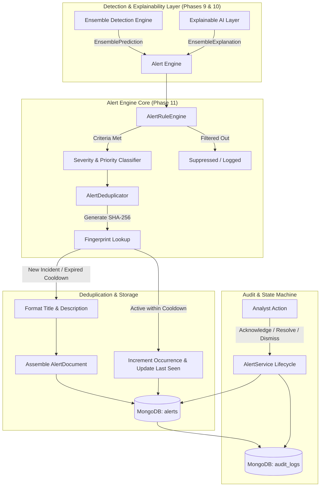
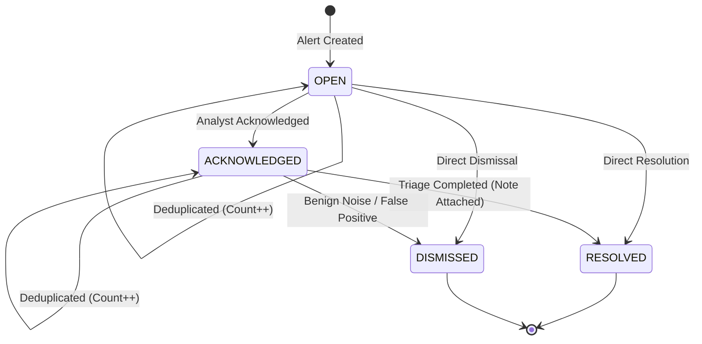

# Phase 11: Security Alert Engine & Lifecycle Management

## 1. Executive Summary

The **Security Alert Engine** is the operational bridge between the AI-based machine learning detection subsystems (Isolation Forest, Autoencoder, LSTM Autoencoder, Random Forest, and the Unified Ensemble Engine) and human Security Operations Center (SOC) analysts or automated incident response workflows.

Rather than flooding operators with raw anomaly scores or disparate model predictions, the Alert Engine:
1. **Evaluates configurable policy rules** and threat thresholds to determine whether incoming ensemble detections warrant alert generation.
2. **Assigns operational severity tiers** (`LOW`, `MEDIUM`, `HIGH`, `CRITICAL`) and actionable incident triage priorities (`LOW`, `MEDIUM`, `HIGH`, `URGENT`).
3. **Applies deterministic SHA-256 fingerprinting and temporal cooldown deduplication** to eliminate alert storms and fatigue caused by recurring anomalous network flows.
4. **Attaches Explainable AI (XAI) feature attributions** and multi-model consensus evidence to explain *why* the activity was flagged.
5. **Maintains a formal incident lifecycle state machine** (`OPEN` $\rightarrow$ `ACKNOWLEDGED` $\rightarrow$ `RESOLVED` / `DISMISSED`).
6. **Records immutable audit logs** for creation, deduplication, and triage status transitions in MongoDB.

---

## 2. Architectural Architecture & Flow



---

## 3. Core Subsystems

### 3.1 Alert Rule Engine (`AlertRuleEngine`)
Evaluates whether an incoming `EnsemblePrediction` warrants security alert generation based on configurable policies:
- **Global Toggle (`ALERTS_ENABLED`)**: System-wide kill-switch.
- **Minimum Risk Cutoff (`ALERT_MIN_RISK_SCORE`)**: Rejects events below the baseline composite risk threshold (default `40.0`).
- **Severity-Specific Toggles**: Granular enabling/disabling of `LOW`, `MEDIUM`, `HIGH`, or `CRITICAL` alerts.
- **Consensus / Agreement Ratio Filter**: Optional requirement on multi-model consensus agreement ratio.
- **Anomaly Flag Check (`require_anomaly_flag`)**: Ensures normal non-anomalous traffic does not trigger alerts.

### 3.2 Severity & Priority Classification (`severity.py`)
Threat severity is derived from composite normalized risk scores ($0.0$ to $100.0$) and mapped to operational incident response priorities:

| Composite Risk Range | Threat Severity | Incident Priority | Operational Urgency |
| :--- | :--- | :--- | :--- |
| **0.0 – 24.9** | `LOW` | `LOW` | Informational logging / metric telemetry |
| **25.0 – 49.9** | `MEDIUM` | `MEDIUM` | Routine queue review |
| **50.0 – 74.9** | `HIGH` | `HIGH` | Accelerated investigation within standard SLA |
| **75.0 – 100.0** | `CRITICAL` | `URGENT` | Immediate SOC page / automated containment |

### 3.3 Deterministic Deduplication & Cooldown (`AlertDeduplicator`)
To prevent alert fatigue from persistent network traffic (e.g. repeated beacons or port scans):
1. **Deterministic Fingerprinting**: Computes a SHA-256 hash over normalized connection flow tuples:
   $$\text{Hash}(\text{src\_ip} : \text{src\_port} \rightarrow \text{dst\_ip} : \text{dst\_port} \mid \text{protocol} \mid \text{alert\_type})$$
   *Note: Instantaneous timestamps are explicitly omitted from the hash so repeated flows match the existing active incident.*
2. **Cooldown Evaluation**: When a detection matches an active (`OPEN` or `ACKNOWLEDGED`) alert:
   - If $\Delta t \le \text{ALERT\_DEDUP\_WINDOW\_SECONDS}$ (default 300s): The existing alert's `occurrence_count` is incremented, `last_seen` timestamp is updated, and the event is deduplicated without generating duplicate alert documents.
   - If $\Delta t > \text{ALERT\_DEDUP\_WINDOW\_SECONDS}$: A new incident alert is initiated.

### 3.4 Contextual Formatter (`AlertFormatter`)
Constructs standardized, factual, and human-readable incident summaries without unsupported attack classification labels:
- **Title Formatting**: Dynamically highlights consensus tier and severity (e.g., *"Critical Multi-Model Anomaly Consensus Detected"* or *"High-Risk Network Anomaly Detected"*).
- **Description Formatting**: Synthesizes the exact ensemble risk score, multi-model consensus ratio, participating detection engine breakdown, flow endpoints, and leading XAI feature attributions.

### 3.5 Explainability & Multi-Model Evidence
Alerts capture detailed structural evidence:
- **Constituent Model Evidence**: Native scores, normalized scores, configured vs. effective dynamic weights, decision thresholds, and inference latencies for Isolation Forest, Autoencoder, LSTM Autoencoder, and Random Forest.
- **Explainable AI (XAI) Attribution**: Attached top contributing features (e.g. `src_bytes`, `dst_host_count`, `serror_rate`), direction of impact (`increases_risk`), and temporal peak anomalous timesteps for sequential models.
- **Graceful Degradation**: If XAI computation fails or is unavailable, alert generation proceeds cleanly with `explanation.is_available = False` and an audit error notice.

---

## 4. Incident Lifecycle State Machine

Security alerts adhere to a strict lifecycle state machine:



### State Definitions:
- **`OPEN`**: Active, unassigned security incident generated by the detection engine. Eligible for cooldown deduplication.
- **`ACKNOWLEDGED`**: Claimed by a security analyst (`assigned_to`). Active investigation in progress.
- **`RESOLVED`**: Threat mitigated or addressed. Requires `resolution_note`. Terminal state (no longer deduplicated).
- **`DISMISSED`**: Identified as benign divergence, authorized scanning, or false positive. Requires `dismissal_reason`. Terminal state.

---

## 5. MongoDB Document Schema & Storage

Alerts are persisted to the `alerts` collection with the following structured schema:

```json
{
  "_id": "ObjectId(...)",
  "alert_id": "alt-8a9b2c3d4e5f",
  "timestamp": "2026-09-08T13:30:00.000Z",
  "detection_result_id": "det-1029384756",
  "alert_type": "network_anomaly",
  "severity": "CRITICAL",
  "priority": "URGENT",
  "title": "Critical Multi-Model Anomaly Consensus Detected",
  "description": "Anomalous network activity was detected from 192.168.1.105 targeting 10.0.0.1 over TCP with an ensemble risk score of 83.2/100.0 (Severity: CRITICAL). Model consensus: 4 of 4 participating detection engines flagged anomalous patterns...",
  "status": "OPEN",
  "risk_score": 83.25,
  "threshold": 50.0,
  "source": { "ip": "192.168.1.105", "port": 49152 },
  "destination": { "ip": "10.0.0.1", "port": 443 },
  "protocol": "TCP",
  "model_evidence": [
    {
      "model_name": "isolation_forest",
      "prediction": "attack",
      "is_anomaly": true,
      "native_score": 0.85,
      "normalized_score": 82.0,
      "configured_weight": 0.25,
      "effective_weight": 0.25,
      "weighted_contribution": 20.5,
      "decision_threshold": 0.5,
      "latency_ms": 1.5,
      "is_available": true
    }
  ],
  "ensemble": {
    "risk_score": 83.25,
    "decision_threshold": 50.0,
    "agreement_ratio": 1.0,
    "consensus_prediction": "attack",
    "models_total": 4,
    "models_available": 4,
    "models_anomalous": 4,
    "models_normal": 0,
    "participating_models": ["isolation_forest", "autoencoder", "lstm_autoencoder", "random_forest"],
    "missing_models": [],
    "reliability_score": 1.0
  },
  "explanation": {
    "explanation_id": "exp-test-001",
    "method": "ensemble_risk_attribution",
    "summary": "High anomalous deviation driven by elevated src_bytes and dst_host_count.",
    "top_features": [
      { "feature_name": "src_bytes", "contribution": 0.45, "direction": "increases_risk", "rank": 1 }
    ],
    "is_available": true
  },
  "deduplication": {
    "fingerprint": "e1132dc984aeeeeca9bdd706704c33d38224cc11037a03384707bd8bab00c402",
    "occurrence_count": 1,
    "first_seen": "2026-09-08T13:30:00.000Z",
    "last_seen": "2026-09-08T13:30:00.000Z"
  },
  "assigned_to": null,
  "resolution_note": null,
  "dismissal_reason": null,
  "metadata": {},
  "created_at": "2026-09-08T13:30:00.000Z",
  "updated_at": "2026-09-08T13:30:00.000Z"
}
```

### Indexed Fields (`backend/app/database/indexes.py`):
1. `alert_id` (Unique ASCENDING)
2. `timestamp` (DESCENDING)
3. `severity` (ASCENDING)
4. `priority` (ASCENDING)
5. `status` (ASCENDING)
6. `risk_score` (DESCENDING)
7. `deduplication.fingerprint` (ASCENDING)
8. `deduplication.last_seen` (DESCENDING)
9. `source.ip` (ASCENDING)
10. `destination.ip` (ASCENDING)
11. `created_at` (DESCENDING)

---

## 6. Audit Trail Logging

Every alert event writes an immutable audit record to the `audit_logs` collection:
- **`ALERT_CREATED`**: Logged with `alert_id`, `severity`, `priority`, `risk_score`, and `fingerprint`.
- **`ALERT_DEDUPLICATED`**: Logged with `alert_id`, `occurrence_count`, `risk_score`, and flow context.
- **`ALERT_ACKNOWLEDGED`**: Logged with `alert_id` and `user_id`.
- **`ALERT_RESOLVED`**: Logged with `alert_id`, `user_id`, and `resolution_note`.
- **`ALERT_DISMISSED`**: Logged with `alert_id`, `user_id`, and `dismissal_reason`.

---

## 7. Operational Configuration Parameters

All alert parameters are externalized in `backend/app/core/config.py` and configurable via `.env`:

| Setting Variable | Type | Default | Description |
| :--- | :--- | :--- | :--- |
| `ALERTS_ENABLED` | `bool` | `True` | Global enable/disable toggle for security alert generation |
| `ALERT_MIN_RISK_SCORE` | `float` | `40.0` | Minimum composite ensemble risk score required to generate alerts |
| `ALERT_LOW_ENABLED` | `bool` | `False` | Whether to persist LOW severity alerts ($0.0 \le \text{score} < 25.0$) |
| `ALERT_MEDIUM_ENABLED` | `bool` | `True` | Whether to persist MEDIUM severity alerts ($25.0 \le \text{score} < 50.0$) |
| `ALERT_HIGH_ENABLED` | `bool` | `True` | Whether to persist HIGH severity alerts ($50.0 \le \text{score} < 75.0$) |
| `ALERT_CRITICAL_ENABLED` | `bool` | `True` | Whether to persist CRITICAL severity alerts ($\text{score} \ge 75.0$) |
| `ALERT_DEDUP_WINDOW_SECONDS` | `int` | `300` | Sliding window in seconds for deduplication and occurrence counting |
| `ALERT_GENERATE_XAI_FOR_HIGH`| `bool` | `True` | Automatically compute and attach XAI attributions for HIGH/CRITICAL |
| `ALERT_MAX_DESCRIPTION_LENGTH`| `int` | `1500` | Maximum character length for operational alert incident descriptions |

---

## 8. Non-Causality Principle & Security Caveats

> [!IMPORTANT]
> **Operational Caveat**:
> The Alert Engine structures and prioritizes behavioral network deviations detected across machine learning models. High-risk alerts indicate strong statistical or structural divergence from normal traffic baselines; they **do not constitute definitive proof of a confirmed cyber breach**.
>
> XAI feature contributions explain mathematical model activations (e.g. elevated byte volume or error rates) and must be utilized by human analysts as diagnostic triage aids rather than absolute attribution of malicious intent.
