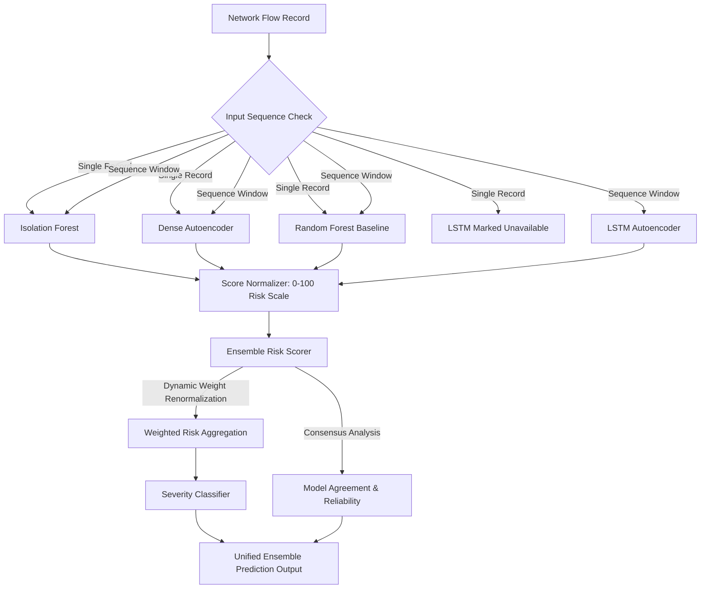

# Phase 9: Unified Ensemble Detection & Risk Scoring Engine

## 1. Overview & Architectural Role

The **Unified Ensemble Detection & Risk Scoring Engine** serves as the central decision layer of the AI-Based Zero-Day Attack Detection System. It fuses the outputs of all four specialized ML/DL models into a standardized composite risk assessment ($0.0 - 100.0$), assigns operational severity tiers, measures inter-model consensus, and computes reliability metrics.



---

## 2. Participating Models & Score Directions

Each underlying model provides distinct detection signals and native score formats:

| Model | Detection Paradigm | Native Score Type | Score Direction | Score Normalization Mapping |
|---|---|---|---|---|
| **Isolation Forest** | Unsupervised point-based anomaly detector | Decision score / Anomaly score | Lower decision score $\rightarrow$ higher risk | Direction-inverted & scaled to $[0, 100]$ |
| **Dense Autoencoder** | Deep neural reconstruction error | Mean Squared Error (MSE) | Higher reconstruction MSE $\rightarrow$ higher risk | Threshold-anchored piecewise scaling |
| **LSTM Autoencoder** | Temporal sequence reconstruction error | Sequence Window MSE | Higher sequence MSE $\rightarrow$ higher risk | Threshold-anchored piecewise scaling |
| **Random Forest** | Supervised classification baseline | Attack class probability | Higher attack probability $\rightarrow$ higher risk | Probability scaling $[0, 1] \rightarrow [0, 100]$ |

---

## 3. Score Normalization Strategies

The `ScoreNormalizer` maps disparate native metrics into a common $[0.0, 100.0]$ risk score without destroying distribution properties:

### A. Threshold-Relative Normalization (Default)
Anchors each model's calibrated decision threshold $\tau_{\text{model}}$ exactly at risk score $50.0$:
$$\text{Normalized Score}(s) = \begin{cases} 50.0 \times \left(\frac{s}{\tau}\right) & \text{if } s \le \tau \\ 50.0 + 50.0 \times \min\left(1.0, \frac{s - \tau}{2\tau}\right) & \text{if } s > \tau \end{cases}$$

### B. Validation Min-Max Scaling
Scales scores using empirical validation reference bounds $[s_{\min}, s_{\max}]$, fitted strictly on validation splits to prevent test-set leakage.

### C. Direct Probability Scaling (Random Forest)
$$\text{Normalized Score}(p) = \text{clip}(100.0 \times p, 0.0, 100.0)$$

---

## 4. Configurable Weights & Missing Model Renormalization

### Default Configured Weights:
- `Isolation Forest`: $0.25$ ($25\%$)
- `Dense Autoencoder`: $0.25$ ($25\%$)
- `LSTM Autoencoder`: $0.25$ ($25\%$)
- `Random Forest`: $0.25$ ($25\%$)

### Dynamic Renormalization on Model Dropout:
If any model is unavailable (e.g. LSTM on single-flow records without sequence history, or missing model weights):
1. The missing model is excluded from aggregation and explicitly recorded in `missing_models`.
2. Participating model weights are dynamically renormalized:
   $$w_i' = \frac{w_i}{\sum_{j \in \text{available}} w_j}$$
3. The composite risk score is computed over available models:
   $$\text{Composite Risk Score} = \sum_{i \in \text{available}} w_i' \cdot \text{Normalized Score}_i$$

---

## 5. Model Agreement & Heuristic Reliability

### Model Agreement Metrics:
- **Agreement Ratio**: $\frac{\max(N_{\text{anomalous}}, N_{\text{normal}})}{N_{\text{available}}} \in [0.5, 1.0]$
- **Disagreement Ratio**: $1.0 - \text{Agreement Ratio}$
- **Consensus Prediction**: Majority vote across participating models (`"anomaly"` vs `"normal"`).

### Heuristic Reliability Score:
Combines model availability coverage and consensus confidence:
$$\text{Reliability} = 0.6 \times \left(\frac{N_{\text{available}}}{N_{\text{total}}}\right) + 0.4 \times (\text{Agreement Ratio}) \in [0.0, 1.0]$$

> [!NOTE]
> The reliability score is an operational heuristic representing ensemble completeness and agreement. It is **not** a calibrated statistical probability.

---

## 6. Severity Classification Tiers

Continuous composite risk scores ($0.0 - 100.0$) are mapped into four non-overlapping, contiguous operational severity tiers:

| Tier | Risk Score Range | Security Interpretation & Recommended Action |
|---|---|---|
| **LOW** | $0.00 - 24.99$ | Nominal baseline traffic. No action required. |
| **MEDIUM** | $25.00 - 49.99$ | Elevated anomaly indicators. Potential policy deviation or benign anomaly. |
| **HIGH** | $50.00 - 74.99$ | Strong multi-model anomaly consensus. SOC investigation recommended. |
| **CRITICAL** | $75.00 - 100.00$ | Confirmed threat pattern or severe anomaly consensus. Immediate mitigation required. |

---

## 7. Unified Output Schema

Every ensemble prediction produces a standardized response conforming to the `EnsemblePrediction` schema:

```json
{
  "model_name": "ensemble",
  "model_version": "1.0.0",
  "prediction": "attack",
  "is_anomaly": true,
  "risk_score": 78.45,
  "severity": "CRITICAL",
  "decision_threshold": 50.0,
  "reliability_score": 0.95,
  "agreement": {
    "models_total": 4,
    "models_available": 4,
    "models_anomalous": 3,
    "models_normal": 1,
    "agreement_ratio": 0.75,
    "disagreement_ratio": 0.25,
    "consensus_prediction": "anomaly"
  },
  "participating_models": ["isolation_forest", "autoencoder", "lstm_autoencoder", "random_forest"],
  "missing_models": [],
  "contributions": {
    "isolation_forest": {
      "model_name": "isolation_forest",
      "prediction": "attack",
      "is_anomaly": true,
      "native_score": 62.5,
      "normalized_score": 62.5,
      "configured_weight": 0.25,
      "effective_weight": 0.25,
      "decision_threshold": 50.0,
      "latency_ms": 0.45
    }
  },
  "latency": {
    "isolation_forest_ms": 0.45,
    "autoencoder_ms": 0.38,
    "lstm_autoencoder_ms": 1.25,
    "random_forest_ms": 0.32,
    "ensemble_aggregation_ms": 0.15,
    "total_ms": 2.55
  }
}
```

---

## 8. CLI Usage

### Evaluate Ensemble across all scenarios:
```powershell
backend\.venv\Scripts\python.exe scripts/evaluate_ensemble.py --dataset synthetic --evaluation all
```

### Evaluate Ensemble with custom weights and decision threshold:
```powershell
backend\.venv\Scripts\python.exe scripts/evaluate_ensemble.py --dataset nsl_kdd --threshold 55.0 --weights "isolation_forest=0.3,autoencoder=0.3,lstm_autoencoder=0.2,random_forest=0.2"
```

### Full 5-Model Comparative Benchmark:
```powershell
backend\.venv\Scripts\python.exe scripts/evaluate_models.py --dataset synthetic --evaluation all --models isolation_forest,autoencoder,lstm_autoencoder,random_forest,ensemble
```
