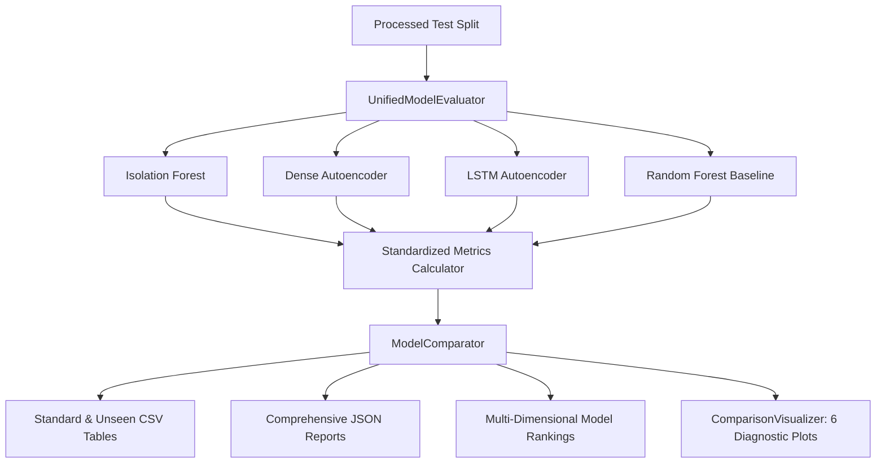

# Phase 8: Unified Evaluation & Model Comparison Framework

## 1. Overview & Architectural Role

The **Unified Evaluation & Model Comparison Framework** provides a standardized, rigorous, and leakage-free benchmark across all four core detection architectures in the AI-Based Zero-Day Attack Detection System:

1. **Isolation Forest** (Phase 4): Unsupervised point-based anomaly detector.
2. **Dense Autoencoder** (Phase 5): Reconstruction-based deep neural network.
3. **LSTM Autoencoder** (Phase 6): Sequential temporal reconstruction deep neural network.
4. **Random Forest** (Phase 7): Supervised baseline classifier.



---

## 2. Evaluation Scenarios & Zero-Day Proxy Methodology

To objectively evaluate detection capabilities, the framework partitions evaluation into three distinct scenarios:

### A. Standard Evaluation
- **Scope**: Evaluates models on the standard held-out test split containing normal network flows and all attack classes.
- **Purpose**: Measures baseline detection capacity and overall classification accuracy.

### B. Known Attack Evaluation
- **Scope**: Evaluates models exclusively on normal flows and attack categories that were present in the training distribution.
- **Purpose**: Establishes performance on familiar threat signatures.

### C. Unseen Attack / Zero-Day Proxy Evaluation
- **Scope**: Evaluates models on normal flows and attack categories that were **completely withheld from training**.
- **Purpose**: Measures the resilience and generalization of anomaly-detection models versus supervised classifiers when confronted with unobserved attack patterns.

> **SCIENTIFIC & ARCHITECTURAL LIMITATION**:
> Unseen attack category evaluation serves as a controlled experimental **proxy** for novel attacks. It measures how effectively an anomaly boundary flags anomalous flows absent from training. However, it is **not** a guarantee or mathematical proof of detecting arbitrary real-world zero-day exploits.

---

## 3. Standardized Metrics & Security-Centric Tradeoffs

Cybersecurity intrusion detection systems face asymmetric operational costs. The framework prioritizes security-relevant metrics over naive accuracy:

| Metric | Security Operational Meaning | Operational Consequence of Failure |
|---|---|---|
| **Recall / Detection Rate (TPR)** | Percentage of actual attacks successfully flagged. | Missed intrusions (Breach / Infiltration). |
| **False Negative Rate (FNR)** | Percentage of attacks that bypassed detection ($1 - \text{Recall}$). | Undetected exfiltration or malicious execution. |
| **Precision** | Percentage of alerts that are genuine attacks. | SOC analyst alert fatigue and wasted triage time. |
| **False Positive Rate (FPR)** | Percentage of benign traffic erroneously alerted ($1 - \text{Specificity}$). | Network friction and operational disruption. |
| **F1-Score** | Harmonic mean of Precision and Recall. | Balances detection completeness and alert purity. |
| **ROC-AUC & PR-AUC** | Discrimination threshold robustness across imbalanced classes. | Indicates separation quality regardless of fixed cutoffs. |

### Mathematical Safeguards & Missing Metric Handling:
If an evaluation split contains only a single class (e.g. only normal traffic in a sanity split), mathematically undefined metrics (such as ROC-AUC or PR-AUC) return `None` (`NaN` in CSV/JSON) and log explicit diagnostic reasons rather than raising unhandled pipeline exceptions.

---

## 4. Multi-Dimensional Model Ranking System

Because no single model dominates across all operational criteria, the framework produces five domain-specific rankings and one transparent composite ranking:

### 1. Zero-Day Proxy Resilience Ranking (Priority for Novel Threats)
- **Primary Metric**: Unseen Attack Recall (Detection Rate on withheld classes).
- **Secondary Metric**: Unseen Attack F1-Score.

### 2. Standard Detection Quality Ranking
- **Primary Metric**: Standard F1-Score.
- **Secondary Metric**: Balanced Accuracy.

### 3. Low False Alarm Viability Ranking (Priority for High-Volume Gateways)
- **Primary Metric**: Precision on standard test data.
- **Secondary Metric**: Lowest False Positive Rate (FPR).

### 4. Breach Sensitivity Ranking (Priority for Critical Infrastructure)
- **Primary Metric**: Recall on standard test data.
- **Secondary Metric**: Lowest False Negative Rate (FNR).

### 5. Inference Efficiency Ranking
- **Primary Metric**: Average Inference Latency per sample/sequence (ms).
- **Secondary Metric**: Throughput (items/second).

### 6. Configurable Composite Ranking Score
$$\text{Composite Score} = w_1 \cdot \text{Recall}_{\text{unseen}} + w_2 \cdot \text{F1}_{\text{std}} + w_3 \cdot \text{Precision} + w_4 \cdot (1 - \text{FPR}) + w_5 \cdot \text{Efficiency}$$

**Default Documented Weights**:
- `unseen_recall`: $0.35$ (35%)
- `standard_f1`: $0.25$ (25%)
- `precision`: $0.20$ (20%)
- `fpr_suppression`: $0.10$ (10%)
- `efficiency`: $0.10$ (10%)

---

## 5. Comparative Visualizations

The `ComparisonVisualizer` generates six publication-grade diagnostic plots in `ml_models/experiments/comparisons/plots/`:

1. **`metrics_comparison_standard_<dataset>.png`**: Grouped bar chart comparing Accuracy, Precision, Recall, F1, ROC-AUC, FPR, and FNR across all evaluated models.
2. **`metrics_comparison_unseen_attack_<dataset>.png`**: Focused bar chart comparing Zero-Day Recall, Zero-Day F1, Zero-Day FNR, Precision, and FPR.
3. **`roc_combined_<dataset>.png`**: Multi-model ROC curves plotted on identical axes with model-specific AUC values.
4. **`pr_curve_combined_<dataset>.png`**: Multi-model Precision-Recall curves plotted on identical axes with model-specific PR-AUC values.
5. **`latency_comparison_<dataset>.png`**: Side-by-side bar charts comparing average latency (ms) and throughput (items/sec).
6. **`confusion_matrix_grid_<dataset>.png`**: Multi-panel subplot grid displaying the confusion matrices of all evaluated models.

---

## 6. Generated Machine-Readable Artifacts

Every comparison execution serializes standardized artifacts under `ml_models/experiments/comparisons/`:

- **`standard_comparison.csv`**: Tabular metrics across all models on the standard test split.
- **`unseen_attack_comparison.csv`**: Tabular metrics focused on withheld attack categories.
- **`overall_comparison.csv`**: Consolidated comparison table merging standard and zero-day proxy metrics.
- **`model_comparison_<dataset>.json`**: Complete structured JSON experiment artifact containing full metric dictionaries, scenario breakdowns, per-category detection rates, latency benchmarks, and multi-dimensional rankings.

---

## 7. CLI Usage

### Benchmark all models across all scenarios:
```powershell
backend\.venv\Scripts\python.exe scripts/evaluate_models.py --dataset synthetic --evaluation all
```

### Benchmark specific models on standard evaluation:
```powershell
backend\.venv\Scripts\python.exe scripts/evaluate_models.py --dataset nsl_kdd --evaluation standard --models isolation_forest,random_forest
```

### Benchmark with explicit unseen attack categories:
```powershell
backend\.venv\Scripts\python.exe scripts/evaluate_models.py --dataset cicids2017 --evaluation unseen_attack --unseen-attacks botnet,infiltration
```
