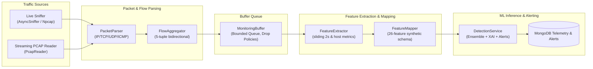

# Real-Time Network Monitoring & Traffic Ingestion Subsystem

## 1. Overview
The Real-Time Network Monitoring Subsystem captures, parses, aggregates, extracts statistical flow features, and feeds bidirectional network flows directly into the ML Ensemble Detection Engine, Explainable AI (XAI) layer, Security Alert Engine, and MongoDB persistence tier.

### Core Architecture Pipeline



---

## 2. Key Components

### 2.1 Packet Parser (`backend.app.monitoring.parsing.packet_parser`)
- Converts raw Scapy packets into typed `PacketInfo` records.
- Extracts Layer 3 (IPv4 / IPv6, TTL, length) and Layer 4 (TCP, UDP, ICMP, ports, TCP control flags `SYN, ACK, FIN, RST, PSH, URG`).
- Robust handling of corrupted packets and non-IP link-layer frames (ARP, LLC).

### 2.2 Bidirectional Flow Aggregator (`backend.app.monitoring.parsing.flow_parser`)
- Maintains active flows identified by canonical 5-tuples: `(src_ip, dst_ip, src_port, dst_port, protocol)`.
- Tracks forward/backward packet counts, byte volumes, and TCP connection state transitions (`SF`, `S0`, `REJ`).
- Infers network services based on standard ports (`http`, `ssl_tls`, `ftp`, `smtp`, `telnet`, `dns`, `eco_i`, `private`).
- Flow expiration management:
  - Inactivity timeout: `MONITOR_FLOW_TIMEOUT_SECONDS` (default: 30.0s).
  - Maximum packet threshold: `MONITOR_FLOW_MAX_PACKETS` (default: 1000).
  - Explicit termination on bidirectional `FIN` or `RST`.

### 2.3 Feature Extractor & Mapper (`backend.app.monitoring.features`)
- **FeatureExtractor**: Calculates statistical flow measurements:
  - Durations, byte ratios, packet ratios, and transfer rates.
  - Sliding 2-second temporal metrics: `count`, `srv_count`, `serror_rate`, `same_srv_rate`, `diff_srv_rate`.
  - Host history metrics across the last 100 connections: `dst_host_count`, `dst_host_srv_count`.
- **FeatureMapper**: Maps statistical measurements into the exact 26-feature schema required by the trained ML models (`synthetic` dataset) with one-hot encoded protocols, services, and TCP flags.
- **Model Compatibility**: Verifies that 100% of required model features are extracted from factual traffic attributes without fabrication.

### 2.4 Bounded Monitoring Buffer (`backend.app.monitoring.buffer`)
- Thread-safe and async-compatible bounded queue (`MonitoringBuffer`) with configurable overflow policies:
  - `drop_oldest`: Evicts oldest items when capacity is exceeded to prevent latency lag.
  - `drop_newest`: Discards incoming flows when full.
  - `backpressure`: Pauses capture ingestion until consumers catch up.

### 2.5 Lifecycle Manager (`backend.app.monitoring.manager`)
- `MonitoringManager` singleton orchestrates background capture threads, telemetry state tracking, and graceful shutdowns.
- Provides isolated synchronous PCAP inspection test runs (`POST /api/v1/monitoring/test-pcap`).

---

## 3. REST API Endpoints

| Method | Path | Summary | Description |
|---|---|---|---|
| `POST` | `/api/v1/monitoring/start` | Start Monitoring | Initiates live interface or PCAP replay capture into the ML pipeline |
| `POST` | `/api/v1/monitoring/stop` | Stop Monitoring | Stops capture, flushes in-flight flows, drains buffer, returns summary |
| `GET` | `/api/v1/monitoring/status` | Get Monitoring Telemetry | Real-time status, pkts/sec, flows/sec, buffer %, anomalies, alerts |
| `POST` | `/api/v1/monitoring/test-pcap` | Isolated PCAP Inspection | Synchronously replays a PCAP and returns analytical benchmark metrics |
| `GET` | `/api/v1/monitoring/compatibility` | Model Compatibility Matrix | Returns feature coverage reports for all registered models |

---

## 4. CLI Tool Usage (`scripts/monitor.py`)

### Check Model Compatibility
```bash
python scripts/monitor.py --check-compat
```

### Replay and Benchmark a PCAP File (Isolated Test Mode)
```bash
python scripts/monitor.py --file data/sample.pcap --test-mode --max-packets 1000
```

### Stream PCAP File Replay into Live Monitoring Pipeline
```bash
python scripts/monitor.py --source pcap --file data/sample.pcap --replay-speed 1.0
```

### Live Interface Capture
```bash
python scripts/monitor.py --source live --interface eth0 --filter "tcp or udp"
```
